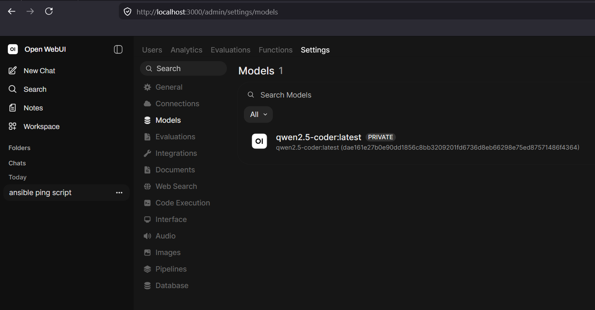

# Zemi LLM Setup 
## Setup Open WebUI with integrated Ollama Docker container
1. Clone zemi_llm_d6y repo
```bash
git clone https://github.com/axo-ma/zemi_llm_d6y.git
cd zemi_llm_d6y
mkdir user_work
mkdir user_data
```
2. Run docker containers with Open WebUI and OLLAMA
```bash
docker-compose up -d
```
3. Add QWEN 2.5 coder model to Ollama
```bash
docker exec -it zemi_llm_d6y_ollama bash -c "ollama pull qwen2.5-coder"
```
After installation, QWEN 2.5 coder will be visible in Open WebUI Settings -> Models:

4. Login to Open WebUI at http://localhost:3000, create a user and password

## Install WinPython
1. Download and install 7-Zip from https://github.com/ip7z/7zip/releases/download/26.02/7z2602.exe
2. Download WinPython distribution package at
https://github.com/winpython/winpython/releases/download/16.6.20250620final/Winpython64-3.12.10.1slim.7z

3. Unpack Winpython64-3.12.10.1slim.7z to any suitable folder on your machine, for example:
```
mkdir "%OME%\zemi_llm"
```
4. Unpack Winpython64-3.12.10.1slim.7z using 7-Zip to
```
%OME%\zemi_llm\
```
5.Now any python app inside winpython environment will be able to connect to ollama using
```
localhost:11434
```
You can list available models using python

Run 
```bash
"%OME%\zemi_llm\WPy64-312101\WinPython Command Prompt.exe"
```
In winpython terminal run
```bash
pip install ollama --upgrade
```
Create and run python script with the following code:

```python
import requests

OLLAMA_URL = "http://localhost:11434"

r = requests.get(f"{OLLAMA_URL}/api/tags", timeout=10)
r.raise_for_status()

data = r.json()

for model in data["models"]:
    print(model["name"])
```
If you see 
```
qwen2.5-coder:latest
```
then you can proceed with using ollama

# Deployment with Standalone Ollama (GUI)
TODO